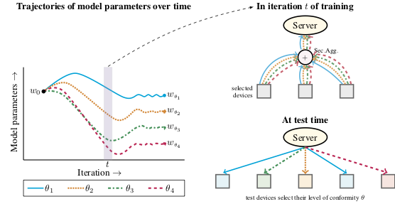

<!-- # Handling Device Heterogeneity in Federated Learning: A Superquantile Approach -->
## Simplicial-FL ()

This code provides an implementation of 
the 

(pronoucned *Simplicial-FL*)
framework to handle device heterogeneity in federated learning.
This codebase is based on a fork of the [Leaf](leaf.cmu.edu) benchmark suite
and provides scripts to reproduce the experimental results in the 
accompanying paper. 




Please cite this paper if you find the repository useful.
```
@article{laugel-etal-2020:simplicial-fl ,
  title={{Device Heterogeneity in Federated Learning:A Superquantile Approach},
  author={Laguel, Yassine and Pillutla, Krishna and  Malick, J\'{e}r\^{o}me and Harchaoui, Zaid},
  journal={arXiv preprint},
  year={2020}
}
```


Introduction
-----------------
Federated Learning is a paradigm to train centralized machine learning models 
on data distributed over a large number of devices such as mobile phones.

This code compares the  approach proposed in the accompanying paper
to the FedAvg algorithm ([McMahan et. al. 2017](https://arxiv.org/abs/1602.05629), referred to 
here also as "Vanilla-FL").
The code has been developed from a fork of [Leaf](leaf.cmu.edu), commit 
```51ab702af932090b3bd122af1a812ea4da6d8740```.


Installation                                                                                                                   
-----------------
This code is written for Python 3.6+
and has been tested on PyTorch 1.0+.
A conda environment file is provided in 
`simplicial_fl.yml` with all dependencies except PyTorch. 
It can be installed by using 
[conda](https://docs.conda.io/projects/conda/en/latest/user-guide/tasks/manage-environments.html#creating-an-environment-from-an-environment-yml-file)
as follows

```
conda env create -f simplicial_fl.yml
```
To run the scripts below, activate the environment using 
```
conda activate simplicial_fl
```


**Installing PyTorch:** Instructions to install 
a PyTorch compatible with the CUDA on your GPUs
can be found [here](https://pytorch.org/get-started/locally/).
Note that PyTorch can be installed without GPU support, and can be used to reproduce experiments
from the paper. 
However, for speed of execution, it is highly recommended to enable GPU support for the neural network 
experiments on datasets EMNIST and Shakespeare.

The primary dependencies are PyTorch, Numpy, Scipy, Pillow and Pandas.
The code has been tested on Ubuntu 16.04.

High-Level Overview
-------------------
The code base implements Vanilla-FL (FedAvg) and the  frameworks. 
The scripts here provide the data setup required for 
three datasets --- EMNIST, Sent140, Shakespeare (descripted below, see the section on "Data Setup").

The file ```models/main.py``` takes the following key arguments:

  * `-dataset`: the name of the dataset
  * `-model`: the name of the model
  * `--run_simplicial_fl`: if True, run , otherwise run Vanilla-FL (FedAvg)
  * `--nonconformity_level`: corresponds to (1-theta), where "theta" is the conformity level, as defined in the paper
  
There are a number of other arguments including the number of rounds, how often to evaluate, the number of devices per round, the learning rate and other hyperparameters. See the scripts for full details.

For each dataset we have two models, a linear model (usually logistic regression, Shakespeare dataset does not have a linear model) and neural network model (ConvNet for EMNIST, LSTM for Sent140 and GRU for Shakespeare). 


Data Setup
-----------
Below we give commands to download and preprocess the data as used in the paper.

1. EMNIST (Called FEMNIST here)

  * **Overview:** Character Recognition Dataset
  * **Details:** 62 classes (10 digits, 26 lowercase, 26 uppercase), 3500 total users, 1730 users used for experiments
  * **Task:** Image Classification
  * **Setup:** Go to ```data/femnist``` and run the command (takes 2.5-3 hours and ~30G of disk space) 
  
```
./preprocess.sh -s niid --sf 1.0 -k 100 -t user --tf 0.5
```

2. Sent140

  * **Overview:** Dataset of tweets of a given user and sentiment of tweet
  * **Details:** 877 users used for experiments
  * **Task:** Sentiment Analysis (Binary Classification)
  * **Setup:** Go to ```data/sent140``` and run the command (takes < 5 min and ~10M of disk space)
 
```
./preprocess.sh -s niid --sf 1.0 -k 50 -t user --tf 0.5
```

3. Shakespeare

  * **Overview:** Text Dataset of Shakespeare Dialogues
  * **Details:** 2288 total users, 545 users used for experiments
  * **Task:** Next-Character Prediction
  * **Setup:** Go to ```data/shakespeare``` and run the command (takes 10-15 min and ~500M of disk space)
 
```
./preprocess.sh -s niid --sf 1.0 -k 100 -t user --tf 0.5
```
  
  <!-- Download `data.tgz` from [this link](https://drive.google.com/file/d/1IPf_jg_Y2ZzFw4wKaHrU2FgWs_MfhPkG/view?usp=sharing), and untar it in ```data/shakespeare``` using the command `tar -zvxf data.tgz`. The data occupies 30M compressed and 160M uncompressed.
  Note: We will update the repository and the paper with a command like the two datasets above to generate the data using a script.
  -->
  


Reproducting Experiments in the Paper
-------------------------------------

Once the data has been set up, the scripts provided in the folder ```scripts/``` can be used 
to reproduce the experiments in the paper.
Note that GPU computations are non-deterministic. Consequently, the neural network
experiments reported in the paper on the datasets EMNIST and Shakespeare, 
which were run using GPUs, are not perfectly reproducible. 

First go to the folder `models` and create the output directories by using 
the following commands in the terminal
```
cd simplicial-fl/models
for dataset in femnist sent140 shakespeare
do
  for model in linear nn
  do
    for method in vanilla_fl simplicial_fl
    do
      mkdir -p outputs/exp/${dataset}/${model}_${method}
    done
  done
done
```

Before the Sent140 experiments can be run, we must first download the GloVe embeddings. 
To this end, run (uses upto 2 GB in temporary space and takes < 5 minutes to execute)
```
./sent140/get_embs.sh
```


Now, each script can be launched, e.g., as 
```
./scripts/exp/shakespeare/nn_simplicial_fl/run_0.2.sh
``` 
This script launches on the Shakespeare data, the  algorithm
using a neural network model in this case with a nonconformity level 0.2.

Note that each script repeats the experiments for 5 different values of the 
random seed.
To run all experiments, use the following commands:
```
for dataset in femnist sent140 shakespeare
do
  for model in nn linear
  do 
    # vanilla FL
    bash ./scripts/exp/${dataset}/${model}_vanilla_fl/run.sh
    # simplicial FL
    for nonconformity_level in 0.2 0.5 0.9
    do
      bash ./scripts/exp/${dataset}/${model}_simplicial_fl/run_${nonconformity_level}.sh
    done
  done
done
```

Output Format
-------------
Each experiment produces a CSV file named by the argument `--output_summary_file` to `main.py`. Each line of this CSV file looks as follows:

```
n, "{'train_device_1': {'loss': 2.2334, 'accuracy': 0.6632}, 'train_device2': {'loss': 2.135, 'accuracy': 0.673}}", "{'test_device1': {'loss': 3.234, 'accuracy: 0.536}, 'test_device2': {'loss': 2.234, 'accuracy': 0.621}}"
```
The first item in each linea is the round number, while the the second item is a JSON containing the loss and accuracy on each train device, and the third item is the corresponding JSON for test devices.

Citation
---------
If you found this repository useful, please cite this paper.

```
@article{laugel-etal-2020:simplicial-fl ,
  title={{Device Heterogeneity in Federated Learning:A Superquantile Approach},
  author={Laguel, Yassine and Pillutla, Krishna and  Malick, J\'{e}r\^{o}me and Harchaoui, Zaid},
  journal={arXiv preprint},
  year={2020}
}
```

